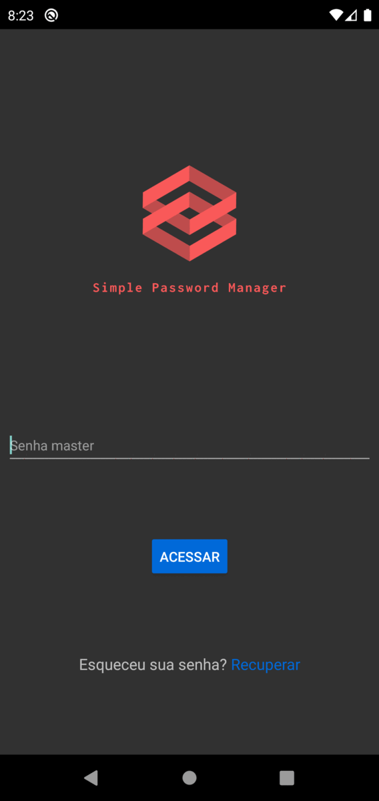

# Password Manager

## What is Password Manager App ?

> Password Manager is an mobile app to secure store encrypted data in local app sandbox using new implemented [MMKV Storage](https://github.com/ammarahm-ed/react-native-mmkv-storage), which is a lot faster than the Async Storage, commonly used.
>> Obs: its on development and do not have an alpha release yet. E.T.A ~07/22 for the first build.

## How it works ? 

> Its auto descriptive, a Password Manager that you can safe store your personal service, websites, bank, and others credentials. Its a minimum safe because it uses MMKV Encryptation technology. The app features a google drive option to backup and restore your data.

## How to run the project

> The project was made with a bare bone React Native CLI. To run, clone or fork the project, then: `yarn react-native run-android` or `yarn react-native start` if you already opened Android Studio Emulator.
